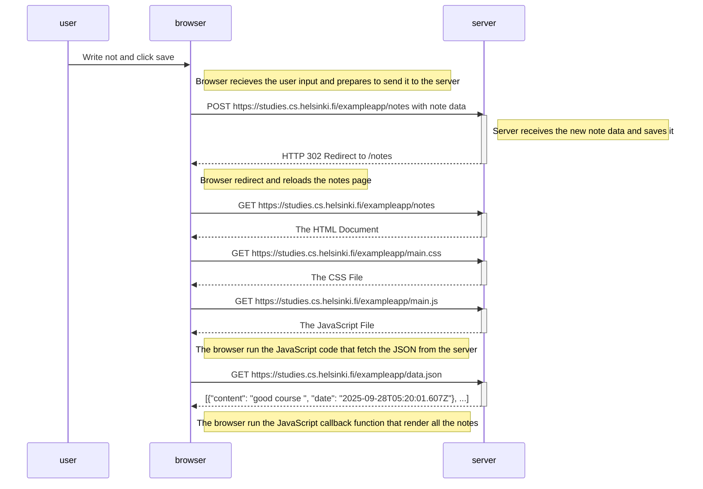

# New Note Diagram

```mermaid
sequenceDiagram
    participant user
    participant browser
    participant server

    user->>browser: Write not and click save
     Note right of browser: Browser recieves the user input and prepares to send it to the server
    
    browser->>server: POST https://studies.cs.helsinki.fi/exampleapp/notes with note data

    activate server
    Note right of server: Server receives the new note data and saves it
    server-->>browser: HTTP 302 Redirect to /notes
    deactivate server

    Note right of browser: Browser redirect and reloads the notes page

    browser->>server: GET https://studies.cs.helsinki.fi/exampleapp/notes
    activate server
    server-->>browser: The HTML Document
    deactivate server

    browser->>server: GET https://studies.cs.helsinki.fi/exampleapp/main.css
    activate server
    server-->>browser: The CSS File
    deactivate server

    browser->>server: GET https://studies.cs.helsinki.fi/exampleapp/main.js
    activate server
    server-->>browser: The JavaScript File
    deactivate server

    Note right of browser: The browser run the JavaScript code that fetch the JSON from the server

    browser->>server: GET https://studies.cs.helsinki.fi/exampleapp/data.json
    activate server
    server-->>browser: [{"content": "good course ", "date": "2025-09-28T05:20:01.607Z"}, ...]
    deactivate server

    Note right of browser: The browser run the JavaScript callback function that render all the notes
```
